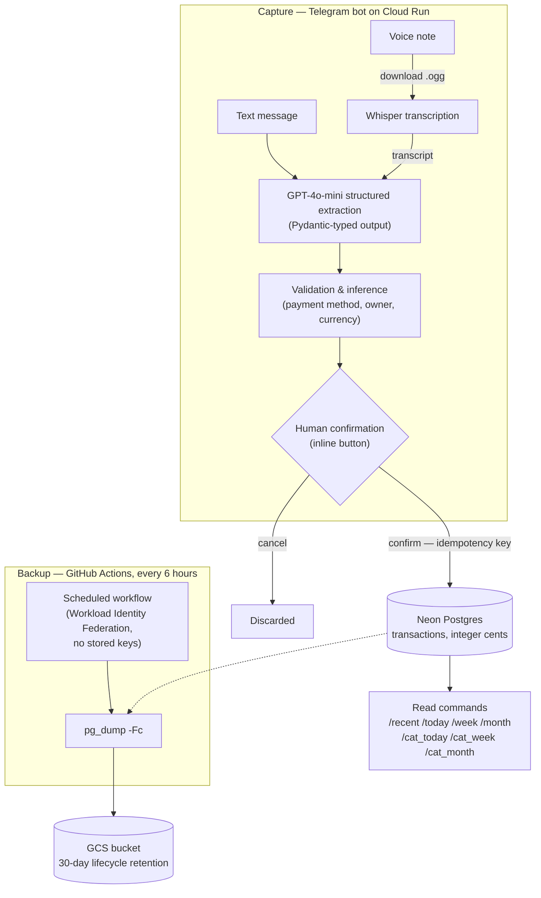

# Unified Ledger Pipeline

A household expense ledger that turns voice notes and typed messages into structured, confirmed
transactions in a multi-currency Postgres ledger.

## The problem

Household spending is scattered across two people, multiple banks and cards, and multiple
currencies — and an expense that isn't captured at the moment of spend usually isn't captured at
all. Spreadsheets fail on friction; raw voice or text capture fails on structure: an amount, a
currency, a category, a payment method and an owner all have to be pulled out of a sentence like
*"nine eighty for lunch on the OCBC card"* before the entry is worth keeping.

This project is the capture side of that problem, built as a small data pipeline: low-friction
ingestion paths that converge on one extraction and validation flow, a human confirmation gate
before anything is written, and a durable Postgres ledger as the single source of truth.
Reconciling that ledger against real bank statements is the next phase of the project — see
[What's next](#whats-next).

## Architecture



**Ingestion.** Two entry paths converge on one pipeline. A voice note is downloaded and
transcribed with OpenAI Whisper; a plain text message is used as-is. From there both are raw
text handled by `process_expense_text` in `app/bot_core.py`: GPT-4o-mini with Pydantic-typed
structured output extracts amount, currency, category, payment method, transaction type and
date, and deterministic rules then infer the payment account and its owner. Nothing is written
without an explicit confirmation tap — a human validation gate between the LLM and the ledger.
Unsupported message types (photos, stickers, documents) get an explicit reply rather than
silence.

**Transport/logic split.** `app/bot_core.py` holds all handlers and business logic but never
starts a network loop; `app/bot_polling.py` runs it as a local long-poll loop, and
`app/bot_webhook.py` wraps the same application in FastAPI behind a `POST /webhook` endpoint
for Cloud Run, where idle containers sleep and polling isn't viable.

**Storage.** Neon Postgres via a pooled SQLAlchemy Core engine. Money is always stored as
integer cents — floats never touch an amount. Alembic owns the schema; there is no
`CREATE TABLE` in application code. Aggregates are grouped by currency (no FX conversion is
performed anywhere).

**Backups.** Neon's free-tier point-in-time recovery only covers a 6-hour window, so an
independent scheduled backup runs from GitHub Actions every 6 hours: `pg_dump -Fc` to a GCS
bucket with 30-day rolling retention, authenticated via Workload Identity Federation so no
long-lived GCP credential exists in this public repo. The restore procedure is documented and
has been exercised — see [`docs/BACKUP_RESTORE.md`](docs/BACKUP_RESTORE.md).

## Key decisions & tradeoffs

Every significant decision is recorded as an ADR in [`docs/decisions/`](docs/decisions/) with
its context, rejected alternatives and cost. The ones that shaped the system most:

- **Money as integer cents, never floats**
  ([ADR-0004](docs/decisions/0004-money-as-integer-cents.md)). Dollar conversion happens only at
  the display/API boundary. Costs a conversion step everywhere; buys exact arithmetic on
  financial data.
- **Neon Postgres over SQLite, with hand-written Alembic migrations**
  ([ADR-0005](docs/decisions/0005-neon-postgres-over-sqlite.md),
  [ADR-0007](docs/decisions/0007-alembic-hand-written-migrations.md)). A file DB can't serve a
  Cloud Run container and a years-long data lifetime. Migrations are written by hand because the
  project uses SQLAlchemy Core, not the ORM — there's no metadata for autogenerate to diff.
- **Transport split from logic**
  ([ADR-0003](docs/decisions/0003-split-bot-transport-from-logic.md)). The same handler code runs
  under local polling and a production webhook; deployment concerns never leak into business
  logic.
- **The raw input is the description — no LLM summary**
  ([ADR-0008](docs/decisions/0008-raw-transcript-as-description.md)). Earlier versions stored an
  LLM-generated summary, which drifted into non-English output. Keeping the user's words verbatim
  is boring and reliable, and preserves the source text for later re-extraction.
- **Idempotent saves via an explicit key**
  ([ADR-0011](docs/decisions/0011-idempotency-key-over-update-id.md)). The confirm button carries
  an idempotency key with `ON CONFLICT DO NOTHING`, so a double-tap can't insert a duplicate —
  chosen over persisting Telegram's `update_id`, which solves a broader problem this volume
  doesn't have yet.
- **Backups scheduled from GitHub Actions, not Cloud Scheduler, with keyless auth**
  ([ADR-0012](docs/decisions/0012-github-actions-over-cloud-scheduler.md),
  [ADR-0013](docs/decisions/0013-workload-identity-federation.md),
  [ADR-0014](docs/decisions/0014-pg-dump-custom-format.md)). The schedule stays versioned and
  reviewable in the repo instead of living as invisible cloud config, and Workload Identity
  Federation means a public repo holds no long-lived credential.

## What's live today

- Voice and text expense capture through the Telegram bot, deployed on Cloud Run.
- Confirmation-gated, idempotent writes to the Postgres ledger.
- Read commands over the ledger (`/recent`, `/today`, `/week`, `/month` and per-category
  variants), aggregated per currency.
- CI on every pull request: clean dependency install, lint, and an import smoke check across
  `app/` — the class of check that stops a merge that would crash the bot on startup.
- 6-hourly `pg_dump` backups to GCS with 30-day retention; restore procedure verified 2026-08-13.
- A small FastAPI REST surface (`GET/POST /transactions`, `app/main.py`) for programmatic entry,
  currently local-only.

## What's next

Forward-looking work, tracked in [`ROADMAP.md`](ROADMAP.md):

- **Reconciliation engine** (Phase 1): parse PDF bank statements
  ([ADR-0016](docs/decisions/0016-pdf-statements-over-csv.md)) into a staging table and match
  them against ledger entries with staged deterministic rules — auto-match only on a unique
  candidate, anything ambiguous routed to review
  ([ADR-0015](docs/decisions/0015-deterministic-matching-before-llm.md)).
- **Evaluation harness** (Phase 2): a hand-labeled golden set of statement-line → ledger-entry
  matches, scored with precision/recall, used to tune the matcher instead of guessing constants.
- Nearer-term: backdated date parsing ("yesterday", "last Tuesday"), edit/delete paths, and a
  pytest suite over the money and date invariants.

## Getting started

Run everything from the repo root (imports use the `app.` prefix via implicit namespace
packages).

```bash
pip install -r requirements.txt

# Initialize the DB (Alembic creates the `transactions` table)
alembic upgrade head

# Run the bot locally against a separate test bot (reads .env.local over .env) — recommended;
# see docs/LOCAL_TESTING.md. Polling with the production token deletes the live webhook.
python -m app.bot_local

# Run the production-style webhook server locally
uvicorn app.bot_webhook:app_fastapi --reload --port 8080

# CLI expense entry / terminal ledger view
python -m app.add_expense --date 2026-07-29 --desc "Lunch" --amount 12.50 --cat Food
python -m app.view_ledger
```

Deployment: `Dockerfile` installs `requirements.txt` and runs
`uvicorn app.bot_webhook:app_fastapi --host 0.0.0.0 --port 8080` (Cloud Run).

### Required environment (`.env`, loaded via `python-dotenv`)

- `TELEGRAM_BOT_TOKEN`
- `ALLOWED_TG_IDS` — JSON object mapping Telegram user ID (string) → display name; the bot's
  allowlist.
- `ACCOUNT_OWNERS` — JSON object mapping a person's name → list of their payment
  accounts/cards, used to reverse-lookup `account_owner` from the extracted payment method.
- `OPENAI_API_KEY`
- `DATABASE_URL` — Postgres connection string (`postgresql+psycopg://...`)
- `WEBHOOK_URL` — optional, only used by `bot_webhook.py` to register the Telegram webhook.
- `ALLOWED_ACCOUNTS` — optional, feeds the extraction prompt's list of valid payment methods.

## Docs

- [`docs/decisions/`](docs/decisions/) — numbered Architecture Decision Records: why each
  choice was made, what was rejected, and what it cost
- [`ARCHITECTURE.md`](ARCHITECTURE.md) — index into the decision records, grouped by area
- [`docs/SCHEMA.md`](docs/SCHEMA.md) — canonical schema reference
- [`docs/BACKUP_RESTORE.md`](docs/BACKUP_RESTORE.md) — backup cadence/retention and the restore
  procedure
- [`docs/LOCAL_TESTING.md`](docs/LOCAL_TESTING.md) — running the bot locally against a separate
  test bot, without disturbing the deployed one
- [`ROADMAP.md`](ROADMAP.md) — current phase, status, and plan
